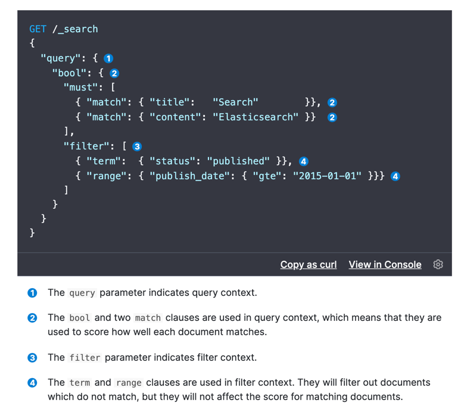

## Get API
### 基本的get
```http request
GET cxc/_doc/1
```
Response
`_source` 中 retrieve 具体数据
```json
{
  "_index" : "cxc",
  "_type" : "_doc",
  "_id" : "1",
  "_version" : 4,
  "_seq_no" : 4,
  "_primary_term" : 1,
  "found" : true,
  "_source" : {
    "name" : "Jim",
    "age" : 30,
    "birthDay" : "1991-10-10",
    "skill" : {
      "language" : "English",
      "sport" : "basketball"
    }
  }
}
```

### response中不要 _source
```http request
GET cxc/_doc/1?_source=false
```

### Source filtering  过滤出 _source 中部分数据
使用 `_source_includes` 过滤出想要的数据  
使用 `_source_excludes` 过滤掉不想要的数据  
当有多个属性需要过滤时，用 `,` 分割
```http request
GET cxc/_doc/1?_source_includes=*.sport,name&_source_excludes=age
```
Response
```json
{
  "_index" : "cxc",
  "_type" : "_doc",
  "_id" : "1",
  "_version" : 4,
  "_seq_no" : 4,
  "_primary_term" : 1,
  "found" : true,
  "_source" : {
    "skill" : {
      "sport" : "basketball"
    },
    "name" : "Jim"
  }
}
```

### 只要 _source 中的数据  （! Deprecation)
```http request
GET cxc/_doc/1/_source
```
当然，后边也可以加 `_source_includes`等参数

### 检查是否有 _source 数据
```http request
HEAD cxc/_doc/1/_source
```
## Query DSL
[参考链接](https://www.elastic.co/guide/en/elasticsearch/reference/6.5/query-filter-context.html#query-filter-context)
### Query context 
#### query 是干嘛的，和 `GET cxc/_doc/1` 有什么不同?
官网回答： 
```markdown
How well does this document match this query clause.  
Besides deciding whether or not the document matches, 
the query clause also calculates a _score representing 
how well the document matches, relative to other documents.
``` 
意思是，除了给出匹配的document之外，还会根据相关度进行打分，有一个 `_score`

### Filter context
过滤条件，过滤数据用的，比如有, match  terms 等  
Filter 有自动 cache 功能，可以提升查询效率

#### Query 与 Filter 
[Elasticsearch 之 Filter 与 Query 有啥不同](https://zhuanlan.zhihu.com/p/161710475)  
[Query and Filter context](https://www.elastic.co/guide/en/elasticsearch/reference/7.x/query-filter-context.html#query-context)

##### 我为什么要说他们的不同?  
- 因为在我只用 `Query context` 不用 `filter context` 能得到相同的结果（至少我现在这么认为哈）   
那么问题来了，为什么要这么麻烦来使用filtering？在什么场景下可以只使用queries ?  
经常用到的过滤条件（唯一性差的，泛的）；  不需要计算相关度得分的
#### Filter cache
[关于缓存](https://www.elastic.co/guide/cn/elasticsearch/guide/current/filter-caching.html#filter-caching)  
- 一旦缓存成功，下次相同的过滤器就可以直接使用，提升效率
- 自动缓存，自动缓存数据，如果是不常用的缓存，es 会自动清除

#### 区别
- Query Context：会对搜索进行相关性算分
- Filter Context：不需要相关性算分，能够利用缓存来获得更好的性能  


### 实战使用
借助官网实例 [Query and filter context](https://www.elastic.co/guide/en/elasticsearch/reference/6.5/query-filter-context.html#query-filter-context)  



### match

#### 1. term
#### 2. terms