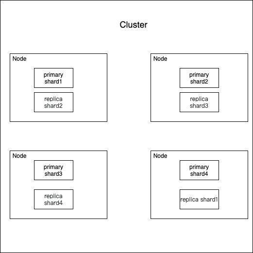
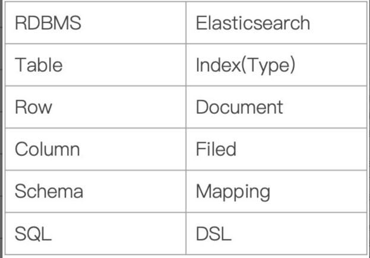

# Arch
  

[参考链接](https://www.zhihu.com/question/323811022)
## Cluster
- 一个cluster由一个或多个node组成
- 一个cluster包含所有的数据
- cluster name是区分cluster的唯一标示（默认是 `elasticsearch` ）, 
  所以多个cluster名字要区分, 比如 `logging-stage` `longging-prod`等
- [cluster](https://www.elastic.co/guide/en/elasticsearch/reference/6.5/getting-started-concepts.html#_cluster)

## Node
- Node 和 cluster一样，都由名字唯一标示，node在启动时候会随机分配一个
- Node 包含很多 Shards

## Shards & Replicas
### 为什么分片
- 一个index的数据可能很大，一个node存不下，所以index存储时可以指定存到几个shards上
- 多个分片，在写入或查询的时候就可以并行操作（从各个节点中读写数据，提高吞吐量）

### 如何实现高可用
- 每个分片都有对应的副本，副本会拷贝主分片数据
- 主分片与相应的副分片不在同一node
- 每个主分片的副本可以有一个或多个
- 默认情况下，es为每个index分配5个shards，和一个replica.  
  如果你有两个node，则5个主的在一个node,另外5个备份的在一个node.

## 其他概念
### 与sql对比解释其概念

