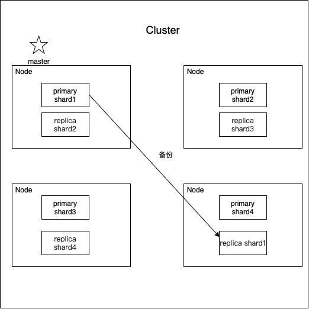
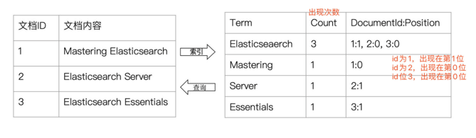
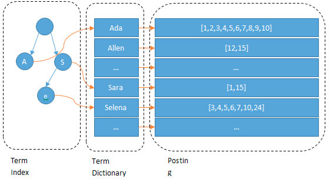
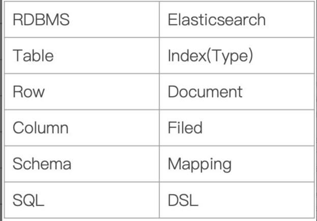

# Arch
  

[参考链接](https://www.zhihu.com/question/323811022)
## Cluster
- 一个cluster由一个或多个node组成
- 一个cluster包含所有的数据
- cluster name是区分cluster的唯一标示（默认是 `elasticsearch` ）, 
  所以多个cluster名字要区分, 比如 `logging-stage` `longging-prod`等
- [cluster](https://www.elastic.co/guide/en/elasticsearch/reference/6.5/getting-started-concepts.html#_cluster)

## Node
- Node 和 cluster一样，都由名字唯一标示，node在启动时候会随机分配一个
- Node 包含很多 Shards

## Shards & Replicas
### 为什么分片
- 一个index的数据可能很大，一个node存不下，所以index存储时可以指定存到几个shards上
- 多个分片，在写入或查询的时候就可以并行操作（从各个节点中读写数据，提高吞吐量）

### 如何实现高可用
- 每个分片都有对应的副本，副本会拷贝主分片数据
- 主分片与相应的副分片不在同一node
- 每个主分片的副本可以有一个或多个
- 默认情况下，es为每个index分配5个shards，和一个replica.  
  如果你有两个node，则5个主的在一个node,另外5个备份的在一个node.

## 倒排索引
### 正排索引

| id | content | 
| ---- | ---- |  
| 1001 | Elasticsearch Docs |
| 1002 | Elasticsearch install |
| 1003 | Kibana Guides |

通过 id 的 主键索引 去搜索相应的内容。
但是对于模糊查询来说，这样的查询效率太低

### 倒排索引
  
根据document内容作为索引  
那么如何分词 ？  
Elasticsearch 内置了很多分词器, 中文的一般使用IK分词器 

#### Elasticsearch 内部结构什么样，如何进行查询的
  
我们输入一段文字，Elasticsearch会根据分词器对我们的那段文字进行分词
（也就是图上所看到的Ada/Allen/Sara..)，这些分词汇总起来我们叫做
`Term Dictionary`，而我们需要通过分词找到对应的记录，这些文档ID保存在
`PostingList`在Term Dictionary中的词由于是非常非常多的，所以我们会为其
进行排序，等要查找的时候就可以通过二分来查，不需要遍历整个Term Dictionary
由于Term Dictionary的词实在太多了，不可能把Term Dictionary所有的词都放在
内存中，于是Elasticsearch还抽了一层叫做Term Index，这层只存储 部分 词的
前缀，Term Index会存在内存中（检索会特别快）Term Index在内存中是以FST
（Finite State Transducers）的形式保存的，其特点是非常节省内存。  
FST有两个优点：
- 空间占用小。通过对词典中单词前缀和后缀的重复利用，压缩了存储空间
- 查询速度快。O(len(str))的查询时间复杂度。

[参考链接](https://www.zhihu.com/question/323811022/answer/981341195)

## 其他概念
### 与sql对比
使用关系型数据库的行和列存储，这相当于是把一个表现力丰富的对象塞到一个非常大的电子表格中：为了适应表结构，你必须设法将这个对象扁平化—​通常一个字段对应一列—​而且每次查询时又需要将其重新构造为对象。  
Elasticsearch 是 面向文档 的，意味着它存储整个对象或 文档。Elasticsearch 不仅存储文档，而且 索引 每个文档的内容，使之可以被检索。在 Elasticsearch 中，我们对文档进行索引、检索、排序和过滤—​而不是对行列数据。这是一种完全不同的思考数据的方式，也是 Elasticsearch 能支持复杂全文检索的原因。
#### 与sql之间的概念映射
