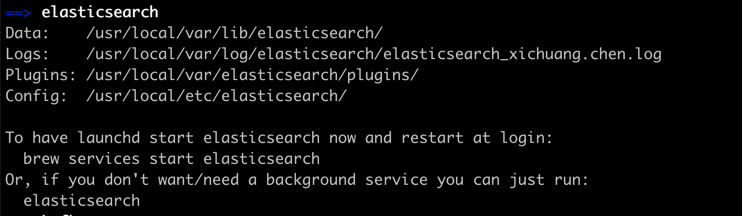

# Install
## Install elasticsearch
**前置条件**:  java version >= java8  
**参考**: [安装并运行](https://www.elastic.co/guide/cn/elasticsearch/guide/current/running-elasticsearch.html)  
#### For Mac
#### 1. 使用 Homebrew 安装
```shell
brew install elasticsearch
```   

#### 2. 启动
非后台启动
```shell 
elasticsearch
```
#### 3. 验证是否安装成功
elasticsearch 启动后
`curl 'http://localhost:9200/?pretty'` (或浏览器中)  
response:
```json
{
  "name" : "XichuangdeMacBook-Pro.local",
  "cluster_name" : "elasticsearch_brew",
  "cluster_uuid" : "RmloOwqKS6mvp4u1vssYPw",
  "version" : {
    "number" : "7.10.2-SNAPSHOT",
    "build_flavor" : "oss",
    "build_type" : "tar",
    "build_hash" : "unknown",
    "build_date" : "2021-01-16T01:34:41.142971Z",
    "build_snapshot" : true,
    "lucene_version" : "8.7.0",
    "minimum_wire_compatibility_version" : "6.8.0",
    "minimum_index_compatibility_version" : "6.0.0-beta1"
  },
  "tagline" : "You Know, for Search"
}
```

