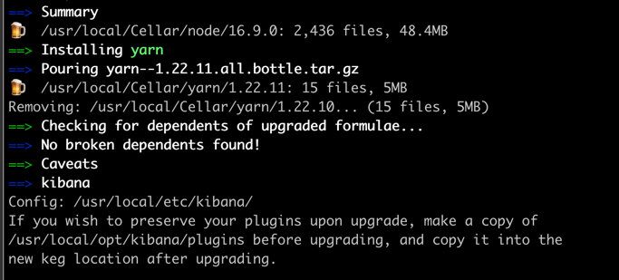

# Install & Config
## Install kibana
**前置条件**: kibana版本号不能高于elasticsearch  
#### For Mac
#### 1. 使用 Homebrew 安装
```shell
brew install kibana
```  
  
***Tips***: 从安装成功之后的提示可以看出， 如果升级kibana，而不想升级现在kibana中的plugins，
升级前先将plugins目录中的数据拷走
#### 2. 启动
非后台启动
```shell
kibana
```
#### 3. 访问
`http://localhost:5601`  
#### 4. 与 elasticsearch 交互
在 `http://localhost:5601` 启动之后页面，点击左侧工具栏 `DevTools`  

***Tips***: 如果是使用的[该elasticsearch安装教程](https://www.elastic.co/guide/cn/elasticsearch/guide/current/running-elasticsearch.html#sense)
安装的elasticsearch，其中会让使用 kibana-plugin 安装 sense,
当你使用[kibana安装插件](https://www.elastic.co/guide/cn/kibana/current/installing_plugins.html) `kibana-plugin install elastic/sense` 时，
会出现如下错误:  
  
这是因为，在最新的kibana中已经有了通过控制台与es交互的功能(就是 `DevTools` )，kibana认为安装sense没有必要. [回答链接](https://stackoverflow.com/questions/40725668/no-valid-url-specified-when-trying-to-install-kibanas-sense-plugin)

## kibana 安装插件
[kibana安装插件](https://www.elastic.co/guide/cn/kibana/current/installing_plugins.html)

## Config

#### 与 elasticsearch
默认情况下，Kibana 会连接运行在 localhost 上的 Elasticsearch 实例。如果需要连接不同的 Elasticsearch实例，可以修改 kibana.yml 配置文件中的 Elasticsearch URL 配置项并重启 Kibana。如果