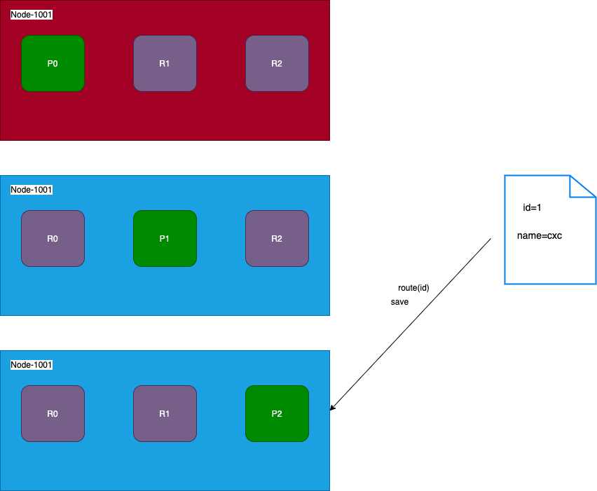

## 写流程
类似于kafka
1. 客户端访问cluster（如何访问，就是随便找集群中一个 node, 这个节点叫协调节点）
2. 协调绩点根据 [路由计算](write-and-read.md#路由计算) 将请求转换到指定节点
3. 主分片保存数据
4. 主分片发送数据到副分片
5. 副分片保存后，反馈
6. 主分片反馈
7. 客户端获得反馈  （类似于kafka 没必要等副分片完成）

*类似与kafka，可以设置获取反馈的时机，比如大多数成功了之类的，也可以设置超时时间等来保证数据一致性*
## 路由计算

现在cluster有3个node， 当插入数据时，如何确定document插入哪个 主分片？  
es有一个路由算法，会根据 id hash出一个主分片

## 分片控制
当取数据时候，去哪个片取？  
用一样的算法，去主片取？  
写入之后，其他副片也有了数据，没必要去主片取啊， 所以，一般来说会轮询查询.

### 读数据
1. 客户端发送查询请求到协调节点
2. 协调节点计算数据所在的分片以及所有的副本位置
3. 负载均衡，轮询节点